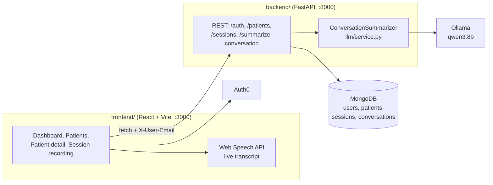

# DocLess

**A clinical documentation assistant that turns nurse-patient conversations into structured records, using a local LLM.** Built at HackRice 2025 (September 2025).

Nurses record a conversation with a patient, DocLess transcribes it in the browser, and a FastAPI backend running Qwen3 8B on Ollama extracts vitals, symptoms, history, concerns and observations into JSON for a doctor to review. The model runs locally, so conversation text never leaves the machine for analysis.

---

## What it does

- **Sign-in and profiles.** Auth0 login for clinicians, with a profile synced to MongoDB on first sign-in.
- **Patient management.** Add, edit and delete patients with demographics, date of birth (age calculated automatically), contact details, medical history and emergency contacts.
- **Session recording.** Record a conversation from a patient's page and get a live transcript through the browser's Web Speech API.
- **Structured summaries.** `POST /summarize-conversation` sends a transcript to Qwen3 8B and returns vitals, symptoms, medical history, patient concerns, nurse observations and a short summary. The prompt limits the model to facts stated in the conversation, with no medical advice.
- **Streaming analysis.** `POST /summarize-conversation-stream` streams the model's progress and the final JSON over Server-Sent Events.

---

## Architecture



---

## Tech stack

- **Frontend:** React 19, TypeScript, Vite, Tailwind CSS 4, Auth0 React SDK, Recharts, lucide-react
- **Backend:** Python, FastAPI, Uvicorn, Pydantic, Motor and PyMongo
- **AI:** Ollama running Qwen3 8B (`qwen3:8b`)
- **Database:** MongoDB

---

## Run it locally

### Prerequisites

- Node.js and npm
- Python 3 and pip
- [Ollama](https://ollama.com) with the model pulled: `ollama pull qwen3:8b`
- MongoDB running locally (or a MongoDB Atlas URL)
- An Auth0 single-page application (free plan works)

### 1. Backend

```bash
cd backend
pip install -r requirements.txt
```

Create `backend/.env`:

```env
MONGODB_URL=mongodb://localhost:27017
MONGODB_DATABASE=docless_db
```

Then:

```bash
ollama serve                 # in its own terminal
python setup_database.py     # creates collections and indexes
python server.py             # http://localhost:8000, docs at /docs
```

### 2. Frontend

In the Auth0 dashboard, create a **Single Page Application** and add `http://localhost:3000` to Allowed Callback URLs, Allowed Logout URLs and Allowed Web Origins.

```bash
cd frontend
cp .env.example .env.local   # set VITE_AUTH0_DOMAIN and VITE_AUTH0_CLIENT_ID
npm install
npm run dev                  # http://localhost:3000
```

The frontend calls the backend at `http://localhost:8000` (`frontend/src/services/api.ts`).

### Try the model without the UI

```bash
curl http://localhost:8000/test-conversation          # summarize a built-in sample
curl -N http://localhost:8000/test-conversation-stream   # same, streamed
python backend/llm/demo_streaming.py                    # streaming demo client
```

More detail on the MongoDB schema and endpoints is in [`backend/README_MONGODB.md`](backend/README_MONGODB.md).

---

## API overview

| Area | Endpoints |
|---|---|
| Health | `GET /health` (Ollama connection and model) |
| Users | `POST /auth/register`, `GET /auth/profile`, `PUT /auth/profile` |
| Patients | `POST /patients`, `GET /patients`, `GET/PUT/DELETE /patients/{id}`, `GET /patients/{id}/conversations` |
| Sessions | `POST/GET /patients/{id}/sessions`, `GET/PUT /sessions/{id}` |
| Summaries | `POST /summarize-conversation`, `POST /summarize-conversation-stream`, `GET /test-conversation`, `GET /test-conversation-stream` |

---

## Status

Hackathon prototype from HackRice 2025. Known gaps:

- Recorded sessions are kept in page state; the recorder is not yet wired to the session and summary endpoints.
- The backend identifies users by an `X-User-Email` header rather than verifying the Auth0 token, and CORS allows all origins. Both need hardening before any real patient data.
- A Google Cloud Speech-to-Text client exists in `frontend/src/services/speechToText.ts` but is not enabled; the browser's speech recognition is used instead.
