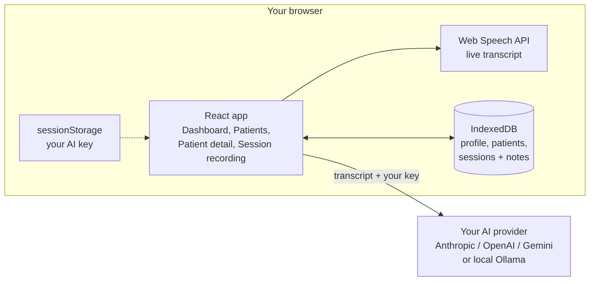

# DocLess

**A clinical documentation assistant that turns nurse-patient conversations into structured visit notes.** Built at HackRice 2025 (September 2025).

**Live demo: https://docless-app.vercel.app**

A nurse opens a patient, records the visit (the browser transcribes it live) or pastes a transcript, and DocLess extracts vitals, symptoms, history, patient concerns and observations into a structured note for a doctor to review. Saved notes feed the patient's latest vitals and an "ask about this patient" assistant.

DocLess is **local-first**: every clinician's profile, patients and notes live in their own browser (IndexedDB). There is no DocLess server or database, so one clinician can never read another's patients. The AI step uses the visitor's **own key** (Anthropic, OpenAI or Gemini) or a **local Ollama model**, called straight from the browser.

> Hackathon project, not a certified medical device and not HIPAA compliant. Use fictional data. A fictional sample patient and transcript are built in.

---

## What it does

- **Local workspace.** Enter your name and role once; no account or login. Data stays in this browser until you delete it.
- **Patients.** Add, edit, search and delete patients (demographics, contact, insurance, chronic conditions, medications, allergies, emergency contact). Age is calculated from date of birth.
- **Visit sessions.** Record a conversation with the Web Speech API (Chrome, Edge, Safari), or type/paste the transcript. Use the built-in sample conversation to try it without a microphone.
- **Structured notes.** One click sends the transcript to your chosen model with an extraction prompt that records only facts stated in the conversation (no advice, no diagnosis) and returns JSON: vitals, symptoms, medical history mentioned, patient concerns, clinician observations, other characteristics and a short summary.
- **Patient overview.** Latest vitals come from the newest note that recorded them; sessions list every note and transcript.
- **Ask about this patient.** Questions are answered only from that patient's record and saved notes.
- **Dashboard.** Real counts (patients, sessions, notes, sessions this week) and a 14-day activity chart.
- **Data control.** Export everything as JSON, import it on another browser, or delete all local data.

## Bring your own key

Open **Settings** (or "Set up AI" inside a session) and pick a provider:

| Provider | Default model | Key |
|---|---|---|
| Anthropic (Claude) | `claude-opus-5` | [console.anthropic.com](https://console.anthropic.com/settings/keys) |
| OpenAI | `gpt-4.1-mini` | [platform.openai.com](https://platform.openai.com/api-keys) |
| Google Gemini | `gemini-2.5-flash` | [aistudio.google.com](https://aistudio.google.com/apikey) |
| Ollama (local) | `qwen3:8b` | none |

The model name is editable. The key is kept in the tab's `sessionStorage` (cleared when the tab closes) and is sent only with your own requests, directly to the provider. The transcript or patient record you are working on goes to that provider; nothing goes anywhere else.

**Local model (the original HackRice setup).** Choose "Ollama" to run extraction on your own machine, as the hackathon build did with Qwen3 8B:

```bash
ollama pull qwen3:8b
OLLAMA_ORIGINS=https://docless-app.vercel.app ollama serve   # not needed when running the app on localhost
```

---

## Architecture


```mermaid
flowchart LR
  subgraph Browser["Your browser"]
    UI["React app<br/>Dashboard, Patients,<br/>Patient detail, Session recording"]
    STT["Web Speech API<br/>live transcript"]
    IDB[("IndexedDB<br/>profile, patients,<br/>sessions + notes")]
    KEY["sessionStorage<br/>your AI key"]
  end
  LLM["Your AI provider<br/>Anthropic / OpenAI / Gemini<br/>or local Ollama"]

  UI --> STT
  UI <--> IDB
  UI -- "transcript + your key" --> LLM
  KEY -.-> UI
```

The whole app is static files on Vercel. Key files:

- `frontend/src/services/db.ts`: IndexedDB storage, export/import/wipe
- `frontend/src/services/ai.ts`: provider calls, extraction prompt, JSON parsing
- `frontend/src/components/SessionRecording.tsx`: record or paste, generate, save
- `frontend/src/components/PatientDashboard.tsx`: overview, sessions, ask-about-patient

## Tech stack

React 19, TypeScript, Vite, Tailwind CSS 4, Recharts, lucide-react, IndexedDB, Web Speech API, Anthropic TypeScript SDK (browser), OpenAI / Gemini REST, Ollama.

## Run it locally

```bash
cd frontend
npm install
npm run dev        # http://localhost:3000
```

No environment variables are needed.

## History

The hackathon version had a FastAPI + MongoDB backend with Ollama summarization and Auth0 login. Its API identified users by a client-supplied `X-User-Email` header without verifying any token, so anyone could read any clinician's patients by setting that header. For the hosted version the backend was removed and storage moved into each browser; the extraction prompt and note schema carry over from `backend/llm/service.py`. The original backend is in the git history (before PR #3).
